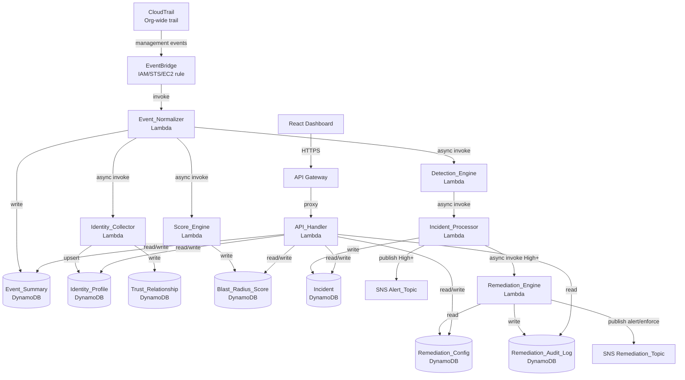
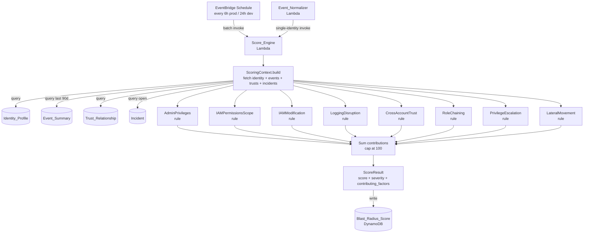
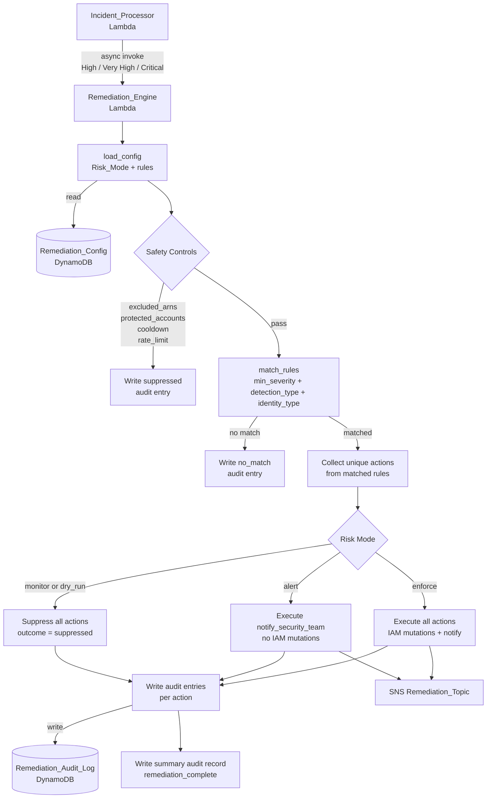
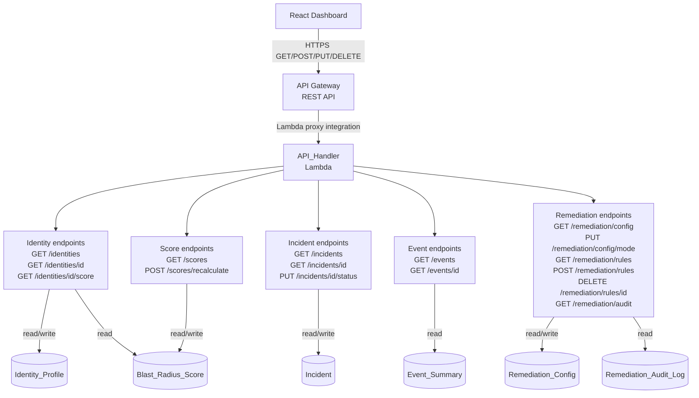

# Design Document — Phase 8: Final Polish and Portfolio Readiness

## Overview

Phase 8 is a documentation, tooling, and presentation phase. No new Lambda logic, DynamoDB tables, or Terraform resources are introduced. The deliverables are: a new README, four Mermaid architecture diagrams, a demo guide, two new scripts (`simulate-attack.py` and `run-tests.sh`), gap-filled documentation, repository hygiene changes, and a project walkthrough document.

All scripts must run locally without live AWS infrastructure using moto for mock mode.

---

## README Design

### File: `README.md` (replace entirely)

The new README follows this exact section order:

```
1. Badges row
2. Project headline (H1)
3. One-paragraph "What is Radius?" description
4. Architecture diagram (embedded Mermaid or linked PNG)
5. Key Features (bullet list)
6. Tech Stack (table)
7. Quick Start (numbered steps)
8. Test Results (code block with run-tests.sh output excerpt)
9. Project Walkthrough (link + one-sentence description)
10. Contributing (one paragraph)
```

### Section Specifications

**Badges row** — use shields.io static badges, all on one line:

```markdown


```

**Project headline** — single H1: `# Radius — Cloud Identity Blast Radius Platform`

**What is Radius?** — one paragraph, ~80 words, covering: what blast radius means in the context of IAM compromise, how Radius monitors CloudTrail events to detect suspicious identity behavior, and that it produces explainable Blast Radius Scores with automated remediation. Accessible to a non-specialist recruiter.

**Architecture diagram** — embed the Mermaid diagram from `docs/architecture/pipeline-overview.md` directly in the README (copy the `flowchart TD` block). This ensures it renders on GitHub without requiring the visitor to navigate to another file.

**Key Features** — six bullet points, each one sentence:
- Real-time detection of 7 IAM attack patterns via rule-based engine
- Explainable Blast Radius Scores (0–100) with named contributing factors
- Automated remediation with three risk modes (Monitor / Alert / Enforce)
- Immutable audit log of every remediation action evaluation
- Multi-account AWS Organizations support via org-wide CloudTrail
- Full property-based test suite using Hypothesis (100+ properties)

**Tech Stack** — Markdown table with columns: Technology, Role:

| Technology | Role |
|---|---|
| AWS Lambda (Python 3.11, arm64) | All backend processing — 7 functions |
| Amazon DynamoDB | Primary data store — 7 tables with GSIs |
| Amazon EventBridge | CloudTrail event routing and Score_Engine scheduling |
| Amazon API Gateway | REST API serving the React dashboard |
| Amazon SNS | High-severity alerts and remediation notifications |
| Amazon CloudTrail | Org-wide management event capture |
| Terraform | Infrastructure as Code — all AWS resources |
| React 18 | Frontend dashboard |
| Hypothesis | Property-based testing framework |
| moto | AWS mock library for local testing |

**Quick Start** — numbered steps:
1. `git clone <repo> && cd radius`
2. `python -m venv .venv && source .venv/bin/activate`
3. `pip install -r backend/requirements-dev.txt`
4. `bash scripts/run-tests.sh` — runs full test suite
5. `python scripts/simulate-attack.py --mode mock` — runs demo scenario locally

**Test Results** — a fenced code block showing representative `run-tests.sh` output (hardcoded excerpt showing suite names, test counts, and coverage percentage). This is a static snapshot, not dynamically generated.

**Project Walkthrough** — one sentence: "For a deep-dive into every design decision, see [docs/walkthrough.md](docs/walkthrough.md)."

**Contributing** — one paragraph noting this is a portfolio project, PRs welcome for bug fixes and documentation improvements.

---

## Architecture Diagram Design

All diagrams use `flowchart TD` (top-down) Mermaid syntax. Each file follows this structure:

```markdown
# <Title>

<2–4 sentence prose introduction>


### (a) `docs/architecture/pipeline-overview.md` — Full Event Pipeline

Shows the complete path from CloudTrail to all downstream consumers.



### (b) `docs/architecture/scoring-pipeline.md` — Scoring Pipeline

Shows Score_Engine trigger sources, context building, rule evaluation, and output.



### (c) `docs/architecture/remediation-branch.md` — Remediation Branch

Shows the remediation pipeline with the three Risk Mode paths annotated.



### (d) `docs/architecture/api-layer.md` — API Layer

Shows the API Gateway → API_Handler → DynamoDB path with endpoint groups.



---

## Demo Scenario Design

### File: `docs/demo/demo-guide.md`

The demo guide narrates a privilege escalation attack by a compromised IAM user. The scenario is designed to exercise every major Radius component in sequence.

**Attack narrative:**
An IAM user `attacker` in account `123456789012` begins by creating a new IAM user, attaches an admin policy to it, creates a new policy version with `*:*` permissions, and then calls `StopLogging` to cover their tracks. This sequence triggers the `PrivilegeEscalation` and `LoggingDisruption` detection rules, creates a Critical-severity incident, scores the identity at 80+, and (in enforce mode) triggers the `disable_iam_user` and `notify_security_team` remediation actions.

**Section structure:**

1. Overview — what the demo shows and why it matters
2. Prerequisites — Python 3.11+, `pip install -r backend/requirements-dev.txt`, no AWS credentials needed in mock mode
3. Attack Scenario — step-by-step narrative of what the attacker does and what CloudTrail events it generates
4. Running the Demo — exact commands using `simulate-attack.py`
5. What to Narrate — bullet points for each phase, written for a live interview presentation
6. Expected Output — annotated screenshot/text of `simulate-attack.py` output
7. Cleanup — `python scripts/simulate-attack.py --mode mock --cleanup` or manual DynamoDB table clear

**CloudTrail events in the scenario (in order):**

| Step | Event | Detection Rule Triggered |
|---|---|---|
| 1 | `iam:CreateUser` | — (context building) |
| 2 | `iam:AttachUserPolicy` | PrivilegeEscalation (CreateUser + AttachUserPolicy in 60m window) |
| 3 | `iam:CreatePolicyVersion` | PrivilegeEscalation (CreatePolicyVersion indicator) |
| 4 | `cloudtrail:StopLogging` | LoggingDisruption (Critical severity) |

---

## simulate-attack.py Design

### File: `scripts/simulate-attack.py`

#### CLI Interface

```
python scripts/simulate-attack.py [OPTIONS]

Options:
  --mode {mock,live}     AWS mode. mock uses moto; live uses real AWS. Default: mock
  --identity ARN         Attacker IAM ARN. Default: arn:aws:iam::123456789012:user/attacker
  --verbose              Print per-event detail during injection
  --phase {1,2,3,4,5}    Run only this phase. Default: all phases
  --timeout SECONDS      Polling timeout for Phase 3. Default: 30
  --help                 Show this message and exit
```

#### Module Structure

```python
scripts/simulate-attack.py
├── main()                    # parse args, run phases, print summary, exit
├── setup_mock_aws()          # start moto mock, create DynamoDB tables and SNS topics
├── phase1_seed_identity()    # write Identity_Profile record to DynamoDB
├── phase2_inject_events()    # inject 4 CloudTrail events via Event_Normalizer logic
├── phase3_poll_incident()    # poll Incident table until privilege_escalation incident found
├── phase4_display_score()    # query Blast_Radius_Score and print formatted output
├── phase5_show_audit_log()   # query Remediation_Audit_Log and print last 10 entries
└── print_phase_summary()     # print formatted table of phase results
```

#### Phase Execution Logic

Each phase function returns a `PhaseResult` dataclass:

```python
@dataclass
class PhaseResult:
    phase: int
    name: str
    status: str        # "PASS" | "FAIL" | "SKIPPED"
    duration_s: float
    output: dict       # phase-specific key/value pairs for summary display
    error: str | None  # populated on FAIL
```

Phase 3 uses a polling loop with 2-second sleep intervals up to `--timeout` seconds. If the incident is not found within the timeout, the phase returns `status="FAIL"` with `error="Timeout waiting for incident"`.

#### Output Format

Each phase prints a header and result block:

```
━━━━━━━━━━━━━━━━━━━━━━━━━━━━━━━━━━━━━━━━━━━━━━━━━━━━━━━━━━━━
Phase 1: Seed IAM Identity
━━━━━━━━━━━━━━━━━━━━━━━━━━━━━━━━━━━━━━━━━━━━━━━━━━━━━━━━━━━━
  Identity ARN : arn:aws:iam::123456789012:user/attacker
  Identity Type: IAMUser
  Account ID   : 123456789012
  Status       : ✓ PASS (0.12s)
```

Final summary table:

```
┌─────────┬──────────────────────────────┬────────┬──────────┐
│ Phase   │ Name                         │ Status │ Duration │
├─────────┼──────────────────────────────┼────────┼──────────┤
│ 1       │ Seed IAM Identity            │ ✓ PASS │ 0.12s    │
│ 2       │ Inject Privilege Escalation  │ ✓ PASS │ 1.43s    │
│ 3       │ Poll for Incident            │ ✓ PASS │ 2.01s    │
│ 4       │ Display Blast Radius Score   │ ✓ PASS │ 0.08s    │
│ 5       │ Show Audit Log               │ ✓ PASS │ 0.09s    │
└─────────┴──────────────────────────────┴────────┴──────────┘
All phases passed. Total: 3.73s
```

#### Mock Mode Implementation

In mock mode, `setup_mock_aws()` uses `moto`'s context manager to mock `dynamodb`, `iam`, `sns`, and `lambda`. It creates the required DynamoDB tables (Identity_Profile, Blast_Radius_Score, Incident, Event_Summary, Remediation_Config, Remediation_Audit_Log) with the correct key schemas and GSIs. It then seeds the Remediation_Config table with a default `monitor` mode config.

Phase 2 in mock mode calls the Event_Normalizer, Detection_Engine, and Incident_Processor Python modules directly (not via Lambda invoke) to simulate the pipeline without Lambda infrastructure.

---

## run-tests.sh Design

### File: `scripts/run-tests.sh`

#### Script Structure

```bash
#!/usr/bin/env bash
# run-tests.sh — Run all Radius test suites and print a coverage summary.
# Usage: bash scripts/run-tests.sh [--fast]
#
# Options:
#   --fast    Skip property-based tests (faster CI mode)

set -euo pipefail

FAST=false
for arg in "$@"; do
  [[ "$arg" == "--fast" ]] && FAST=true
done

# Suite 1: Unit tests
run_suite "Unit Tests" \
  "pytest backend/tests/ --ignore=backend/tests/integration \
   --ignore=backend/tests/test_*_properties.py \
   --cov=backend --cov-report=term-missing -q"

# Suite 2: Integration tests
run_suite "Integration Tests" \
  "pytest backend/tests/integration/ \
   --cov=backend --cov-append --cov-report=term-missing -q"

# Suite 3: Property-based tests (skipped with --fast)
if [[ "$FAST" == "false" ]]; then
  run_suite "Property-Based Tests" \
    "pytest backend/tests/test_*_properties.py \
     --cov=backend --cov-append --cov-report=term-missing -q"
fi

print_summary_table
```

#### `run_suite` Function

Captures stdout/stderr, records start/end time, counts passed/failed from pytest output, and stores results in an array for the summary table.

#### Summary Table Format

```
━━━━━━━━━━━━━━━━━━━━━━━━━━━━━━━━━━━━━━━━━━━━━━━━━━━━━━━━━━━━━━━━━━━━━━━━━━━━
Test Suite Summary
━━━━━━━━━━━━━━━━━━━━━━━━━━━━━━━━━━━━━━━━━━━━━━━━━━━━━━━━━━━━━━━━━━━━━━━━━━━━
Suite                  Tests   Passed  Failed  Coverage  Duration
─────────────────────────────────────────────────────────────────────────────
Unit Tests             142     142     0       87%       18.4s
Integration Tests       38      38     0       91%       24.1s
Property-Based Tests    12      12     0       89%        8.7s
─────────────────────────────────────────────────────────────────────────────
TOTAL                  192     192     0       89%       51.2s
━━━━━━━━━━━━━━━━━━━━━━━━━━━━━━━━━━━━━━━━━━━━━━━━━━━━━━━━━━━━━━━━━━━━━━━━━━━━
All tests passed.
```

Exit code 0 on all pass, 1 on any failure.

---

## Documentation Gaps to Fill

### `docs/api-reference.md`

Missing: All 6 remediation endpoints. Add a new "Remediation" section after the existing "Incidents" section with:
- `GET /remediation/config` — response schema showing `risk_mode`, `rules[]`, `excluded_arns`, `protected_account_ids`
- `PUT /remediation/config/mode` — request body `{"risk_mode": "monitor|alert|enforce"}`, 200/400 responses
- `GET /remediation/rules` — response schema showing rules array ordered by `priority`
- `POST /remediation/rules` — request body schema (all rule fields), 201 response with generated `rule_id`
- `DELETE /remediation/rules/{rule_id}` — 204 on success, 404 if not found
- `GET /remediation/audit` — query params (`incident_id`, `identity_arn`, `limit`), response schema

### `docs/deployment.md`

Missing: Phase 7 additions. Add a "Phase 7 Resources" section listing:
- New Lambda: `{env}-remediation-engine` with env vars `REMEDIATION_CONFIG_TABLE`, `REMEDIATION_AUDIT_TABLE`, `REMEDIATION_TOPIC_ARN`, `DRY_RUN`
- New DynamoDB tables: `{env}-remediation-config`, `{env}-remediation-audit-log`
- New SNS topic: `{env}-radius-remediation`
- New env var on `incident_processor`: `REMEDIATION_LAMBDA_ARN`
- IAM permissions added to `remediation_engine` role

### `docs/developer-guide.md`

Missing: Test suite instructions. Add a "Running Tests" section with:
- How to install test dependencies: `pip install -r backend/requirements-dev.txt`
- How to run all tests: `bash scripts/run-tests.sh`
- How to run fast (no PBT): `bash scripts/run-tests.sh --fast`
- How to run a single test file: `pytest backend/tests/test_remediation_engine.py -v`
- How to interpret coverage output

### `docs/monitoring.md`

Missing: Remediation_Engine log group, correlation ID propagation section, CloudWatch Logs Insights queries. Add:
- Log group entry for `/aws/lambda/{env}-remediation-engine`
- "Correlation ID Propagation" section explaining the `correlation_id` field flow
- Three example Logs Insights queries (by correlation_id, recent incidents, remediation by identity)

### `docs/database-schema.md`

Missing: `Remediation_Config` and `Remediation_Audit_Log` table schemas. Add full schema entries for both tables including: key schema, GSIs, TTL config, and a complete example record.

---

## Repository Hygiene Changes

### Files to Delete

| File | Reason |
|---|---|
| `IMPLEMENTATION_SUMMARY.md` | Stale Phase 2 content; replaced by README and walkthrough |

### Files to Update

| File | Change |
|---|---|
| `.gitignore` | Add: `__pycache__/`, `*.pyc`, `.pytest_cache/`, `.hypothesis/`, `*.egg-info/`, `dist/`, `build/`, `.env`, `.env.*`, `*.tfstate`, `*.tfstate.backup`, `.terraform/`, `node_modules/`, `frontend/build/`, `coverage.xml`, `.coverage`, `htmlcov/` |

### Files to Create

| File | Content |
|---|---|
| `.python-version` | `3.11` |

### Python File Docstrings

Every file in `backend/functions/` that is missing a module-level docstring needs one added. Audit each file and add a one-sentence docstring at the top (after any existing imports guard). Files to check:
- `backend/functions/event_normalizer/handler.py`
- `backend/functions/event_normalizer/normalizer.py`
- `backend/functions/detection_engine/handler.py`
- `backend/functions/detection_engine/engine.py`
- `backend/functions/detection_engine/context.py`
- `backend/functions/incident_processor/handler.py`
- `backend/functions/incident_processor/processor.py`
- `backend/functions/identity_collector/handler.py`
- `backend/functions/identity_collector/collector.py`
- `backend/functions/score_engine/handler.py` (if exists)
- `backend/functions/api_handler/handler.py`
- `backend/functions/api_handler/handlers.py`
- `backend/functions/remediation_engine/handler.py`
- `backend/functions/remediation_engine/engine.py`
- `backend/functions/remediation_engine/audit.py`
- `backend/functions/remediation_engine/config.py`

### Shell Script Headers

Every script in `scripts/` needs a `#!/usr/bin/env bash` shebang and a comment block. Scripts to update:
- `scripts/build-lambdas.sh`
- `scripts/deploy-infra.sh`
- `scripts/verify-deployment.sh`
- `scripts/inject-events.py` (Python shebang: `#!/usr/bin/env python3`)
- `scripts/seed-dev-data.py` (Python shebang: `#!/usr/bin/env python3`)

---

## Project Walkthrough Design

### File: `docs/walkthrough.md`

**Target length:** 1,800–2,500 words

**Section structure:**

1. **Why I Built Radius** — motivation: blast radius as a mental model for IAM risk, gap in open-source tooling for explainable identity scoring
2. **Architecture Decisions**
   - Why serverless (Lambda + DynamoDB): cost model, no idle compute, scales to zero
   - Why event-driven (EventBridge + async invokes): decoupled processing, each function independently testable
   - Why DynamoDB over RDS: single-table-ish access patterns, no joins needed, pay-per-request billing
   - Why not streaming (Kinesis): CloudTrail volume doesn't justify stream infrastructure; EventBridge is sufficient
3. **Detection Engine Design**
   - Two rule types (single-event vs context-aware): why context matters for burst detection
   - DetectionContext: two DynamoDB queries per invocation, pre-fetched before any rule runs
   - Deduplication in Incident_Processor (not Detection_Engine): keeps Detection_Engine stateless
4. **Scoring Model Design**
   - Why rule-based (not ML): explainability, no training data needed, transparent to operators
   - Contributing factors: every point is traceable to a named rule
   - Score cap at 100: prevents runaway scores from correlated indicators
5. **Remediation Design**
   - Three risk modes: safe default (monitor), progressive promotion
   - Safety controls: cooldown and rate limit prevent runaway automation
   - Audit log: append-only, TTL 365 days, immutable record for compliance
6. **Testing Strategy**
   - Unit tests: fast, isolated, mock AWS clients
   - Integration tests: moto for realistic DynamoDB/SNS/IAM behavior
   - Property-based tests (Hypothesis): invariants that hold across all inputs (severity ordering, round-trip serialization, monitor mode suppression)
7. **What I Would Do Differently**
   - Add Kinesis for high-volume environments
   - Add a feedback loop for false-positive rate tracking
   - Replace static confidence values with Bayesian updating
8. **Common Interview Questions** — 8 Q&A pairs covering:
   - How does Radius scale to 1,000 accounts?
   - What's the cost model at 10M events/day?
   - How do you prevent false positives from triggering remediation?
   - How would you add a new detection rule?
   - How do you ensure the audit log is tamper-proof?
   - What's the blast radius of Radius itself being compromised?
   - How would you add real-time streaming?
   - What would you change about the scoring model?

---

## Correctness Properties

### Property 1: simulate-attack.py Phase Ordering

For any invocation without `--phase`, phases execute in order 1 → 5. Phase N+1 does not start if Phase N returns `status="FAIL"`.

**Implementation:** The `main()` function iterates over `[phase1, phase2, phase3, phase4, phase5]` in order. After each call, if `result.status == "FAIL"`, the loop breaks and remaining phases are marked `SKIPPED`.

**Test approach:** Unit test `main()` with a mock `phase2` that raises an exception; assert phases 3–5 are never called and appear as `SKIPPED` in the summary.

**Validates: Requirement 4.3, Phase 8 Property 1**

### Property 2: run-tests.sh Exit Code Consistency

Exit code is 0 iff all executed suites have zero failures.

**Implementation:** The script accumulates a `TOTAL_FAILURES` counter. At the end: `exit $([[ $TOTAL_FAILURES -eq 0 ]] && echo 0 || echo 1)`.

**Test approach:** Run `bash scripts/run-tests.sh` against the real test suite; assert exit code 0. Introduce a deliberate test failure in a temp file; assert exit code 1.

**Validates: Requirement 5.5, Phase 8 Property 2**

### Property 3: simulate-attack.py Mock Mode Isolation

In mock mode, no real AWS API calls are made. The script produces identical output regardless of whether `AWS_ACCESS_KEY_ID` is set.

**Implementation:** `setup_mock_aws()` activates moto's `mock_aws()` context manager before any boto3 client is created. All DynamoDB, SNS, IAM, and Lambda calls go through moto.

**Test approach:** Run `simulate-attack.py --mode mock` with `AWS_ACCESS_KEY_ID` unset; assert all phases pass. Run again with a fake `AWS_ACCESS_KEY_ID=FAKE`; assert identical output.

**Validates: Requirement 4.4, Phase 8 Property 3**
