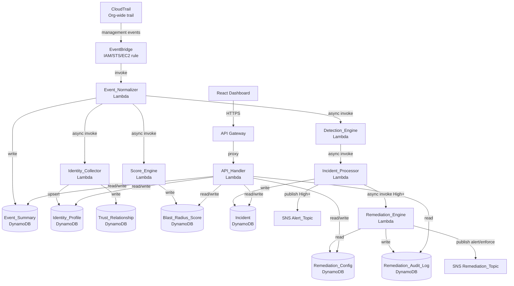

# Radius — Cloud Identity Blast Radius Platform

When an IAM identity is compromised, the blast radius is how much damage it can do. Radius monitors AWS CloudTrail control-plane events across your entire organization, detects suspicious IAM behavior in real time, and calculates an explainable Blast Radius Score (0–100) for every identity. When a score crosses a severity threshold, Radius can automatically trigger remediation actions — disabling users, revoking sessions, or notifying your security team — with a full audit trail of every decision.



## Key Features

- Real-time detection of 7 IAM attack patterns via a rule-based engine
- Explainable Blast Radius Scores (0–100) with named contributing factors per identity
- Automated remediation with three risk modes: Monitor, Alert, and Enforce
- Immutable audit log of every remediation action evaluation for compliance
- Multi-account AWS Organizations support via org-wide CloudTrail
- Full property-based test suite using Hypothesis (100+ correctness properties)

## Tech Stack

| Technology | Role |
|---|---|
| AWS Lambda (Python 3.11, arm64) | All backend processing — 7 functions |
| Amazon DynamoDB | Primary data store — 7 tables with GSIs |
| Amazon EventBridge | CloudTrail event routing and Score_Engine scheduling |
| Amazon API Gateway | REST API serving the React dashboard |
| Amazon SNS | High-severity alerts and remediation notifications |
| Amazon CloudTrail | Org-wide management event capture |
| Terraform | Infrastructure as Code — all AWS resources |
| React 18 | Frontend dashboard |
| Hypothesis | Property-based testing framework |
| moto | AWS mock library for local testing |

## Quick Start

1. `git clone <repo> && cd radius`
2. `python -m venv .venv && source .venv/bin/activate`
3. `pip install -r backend/requirements-dev.txt`
4. `bash scripts/run-tests.sh` — runs the full test suite
5. `python scripts/simulate-attack.py --mode mock` — runs the demo scenario locally, no AWS credentials needed

> The React dashboard requires a deployed AWS backend. Steps 4 and 5 above work entirely offline. To run the full stack including the UI, follow [docs/deployment.md](docs/deployment.md) to deploy to AWS first.

## Test Results

Run the test suite yourself to see current coverage:

```bash
pip install -r backend/requirements-dev.txt
bash scripts/run-tests.sh
```

The suite covers unit tests, integration tests (using moto AWS mocks), and property-based tests via Hypothesis.

## Deploying to AWS

To deploy Radius in your own AWS account, see [docs/deployment.md](docs/deployment.md). It covers prerequisites, Terraform state setup, building Lambda packages, deploying infrastructure, and verifying the deployment. For extending the platform with new rules or running the test suite, see [docs/developer-guide.md](docs/developer-guide.md).

## Project Walkthrough

For a deep-dive into every design decision, see [docs/walkthrough.md](docs/walkthrough.md).

## Contributing

This is a portfolio project. Pull requests are welcome for bug fixes and documentation improvements. Please open an issue first to discuss any significant changes, and ensure all tests pass before submitting.
