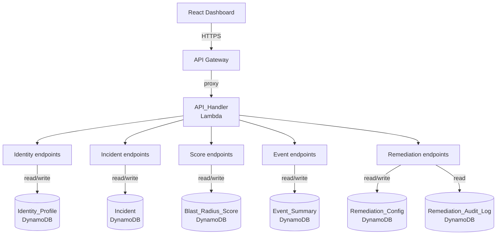

# API Layer

The React Dashboard communicates with the backend exclusively through API Gateway over HTTPS. API Gateway proxies every request to the API_Handler Lambda, which handles all read and write operations against DynamoDB. The handler is organized into five endpoint groups — Identity, Incident, Score, Event, and Remediation — each backed by its own DynamoDB table or pair of tables. No Lambda function other than API_Handler is reachable from the frontend.

