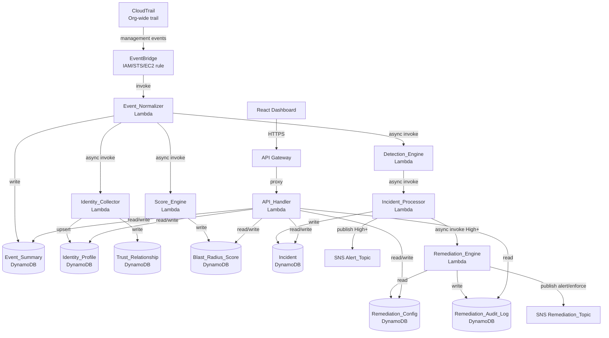

# Pipeline Overview

Radius processes AWS CloudTrail management events through a fully serverless, event-driven pipeline. CloudTrail captures org-wide control-plane activity and routes it through EventBridge to the Event_Normalizer Lambda, which is the single entry point for all downstream processing. From there, Detection_Engine, Identity_Collector, and Score_Engine are invoked asynchronously — each operating independently so a slow scoring run never blocks incident creation. The React Dashboard reads all pipeline outputs through API Gateway and the API_Handler Lambda.

