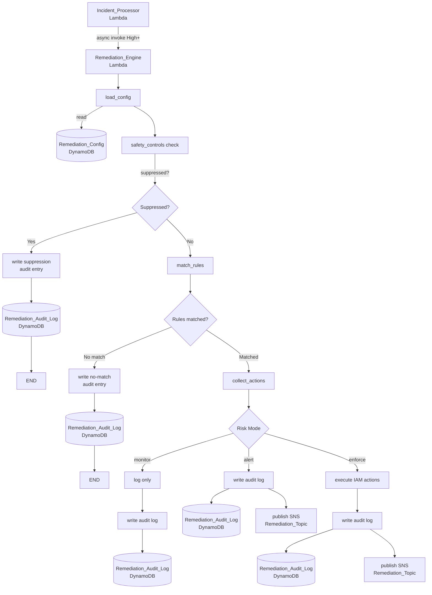

# Remediation Branch

When Incident_Processor creates a High, Very High, or Critical severity incident, it asynchronously invokes the Remediation_Engine Lambda. The engine is configuration-driven: it loads a singleton Remediation_Config record, runs four safety control checks before any rule matching, and then executes actions according to the configured risk mode (monitor, alert, or enforce). Every evaluation — including suppressed and no-match cases — writes an append-only entry to the Remediation_Audit_Log table.

