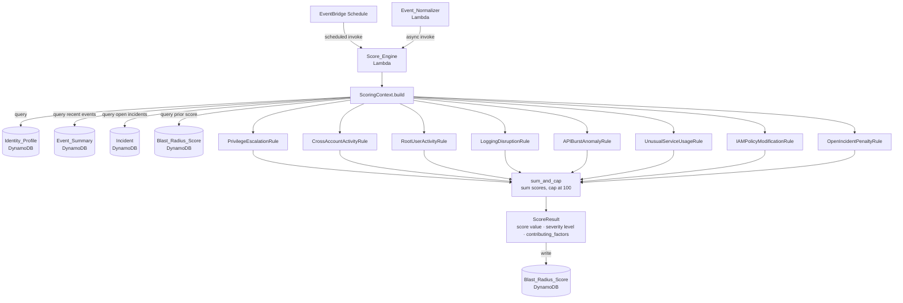

# Scoring Pipeline

The Score_Engine Lambda calculates a Blast Radius Score (0–100) for each IAM identity by evaluating eight rule-based scoring rules against a pre-fetched ScoringContext. It can be triggered on a per-identity EventBridge schedule or invoked directly by Event_Normalizer for immediate scoring after a new event arrives. Each rule emits a named contributing factor with a point value, making every score fully explainable. The final score is the sum of all rule contributions, capped at 100 to prevent correlated-indicator inflation.

